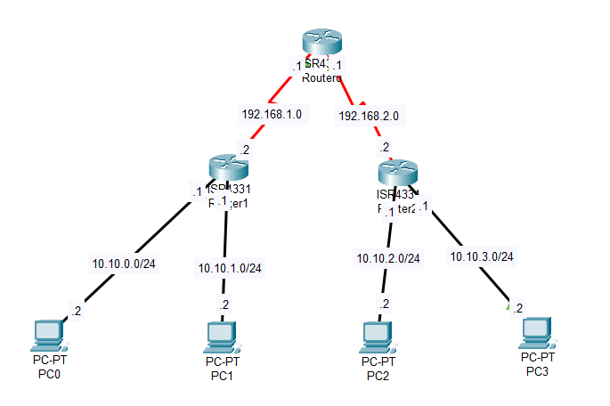

# Настройка Access Lists

## Топология


## ТЗ
Предположим, что мы хотим, чтобы PC3 не мог пинговать PC0

## Предварительная настройка

Сначала нужно настроить IP адрса на маршрутизаторах и хостах.

Так как маршрутизаторы соеденены по Serial, то на Router0 нужно указать clock rate. Как пример, привожу только Router0, так как настройка на остальных аналогична.

Router0
```
(conf)#int serial 0/1/0
(conf-if)#no shutdown
(conf-if)#clock rate 9600
(conf-if)#ip address 192.168.1.1 255.255.255.0
(conf)#int serial 0/1/1
(conf-if)#no shutdown
(conf-if)#clock rate 9600
(conf-if)#ip address 192.168.2.1 255.255.255.0
```

Теперь хосты. Так же привожу пример только один хост - PC0.

```
ip address - 10.10.0.2
mask - 255.255.255.0
default gw - 10.10.0.1
```

Затем нам нужно настроить маршрутизацию, например через RIP. Для этого отправляю вас [сюда](Base.md#rip).

Наконец-то переходим к ACL.

ACL деляться на стандартные и расширенные. Они различаются тем, что стандартные ACL могут фильтровать траффик только по ip адресу источника. Расширенные могут как в адрес источника, так и в адрес назначения.

Мы будем использовать стандартные, так как достаточно фильтровать по адресу источника.

На Router1 нам нужно создать acl следующим образом
```
#(config)access-list 1 deny host 10.10.3.2
#(config)access-list 1 permit any
```

Первая строка запрещает трафик от хоста с адресом 10.10.3.2. Вторая - разрешает весь трафик. Выглядит странно, но так нужно.
В acl порядок правил имеет значение. Т.е. например, если вы сначала запретили трафик с какого-то адреса, а потом разрешили, то он будет запрещен. По умолчанию, acl заканчивается правилом, запрещающим любой трафик, а нам это не нужно. Поэтому последним правилом мы указываем разрешение всего трафика.

Затем, нужно применить правило на нужный интерфейс. В данном случае тот, за которым находится PC0
```
#(config-if)ip access-group 1 out
```