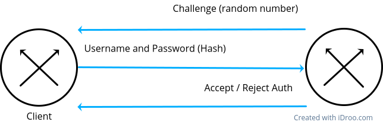

# Auth PAP and CHAP. Automatic ip address via PPPoE.
собрать цепочку из трех маршрутизаторов через ethernet. Центральный - сервер, крайние клиенты. Один из клиентов автоматизировать по pap, другой по chap (методы авторизации). Автоматическое получение адресов за счет PPPoE (не DHCP)

## PAP


## CHAP


## PPPoE


## Настройка

### Сервер
```
(conf)#		username client
(conf)#		password 12345
(conf)#		ip local pool PoolName 192.168.1.1 192.168.1.2

(conf)#		virtual-template 1
(conf-if)#	ip unnumbered gi 0/0		//Имя физ. интерфейса, который смотрит на клиент
(conf-if)#	peer default ip address pool PoolName
(conf-if)#	ppp authentication chap			//Если нужен pap, пишем pap

(conf)#		interface gi 0/0
(conf-if)# 	no shutdown
(conf-if)# 	ip address 192.168.1.2 255.255.255.0
(conf-if)# 	mtu 1492				// сколько байт передается за один раз минус заголовок PPPoE

(conf)# 	bba-group pppoe GroupName
(conf-bba)#	virtual-template 1

(conf)# 	interface gi 0/0
(conf-if)# 	pppoe enable group GroupName
```

### Клиент c chap
```
(conf)# 	interface gi 0/0
(conf-if)#	pppoe enable
(conf-if)#	pppoe-client dial-pool-number 4		// какой номер искать

(conf)#		interface dialer 1
(conf-if)#	mtu 1492
(conf-if)#	ip address negotiated
(conf-if)# 	encapsulation ppp
(conf-if)#	dialer pool 4				// задали номер
(conf-if)#	ppp authentication chap
(conf-if)# 	ppp chap hostname client
(conf-if)# 	ppp chap password 12345
(conf-if)#	password 12345

(conf)#		ip route 0.0.0.0 0.0.0.0 Dialer 1 200
```

### Клинет с pap
Все то же самое, только в interface Dialer команда настройки имени и пароля другая
```
(conf-if)#	ppp authentication pap
(conf-if)# 	ppp pap sent-username client password 12345
```

### Замечание
Рекомендую делать пул из двух адресов. Почему-то на CHAP клиента начинают бездумно отправляться все адреса
и из-за этого на сервере ломается таблица маршрутизации. Как правильно фиксить эту проблему не ясно.