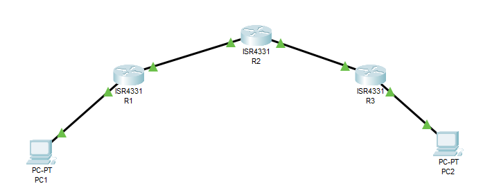

# Список разный полезных вещей, которые нужно уметь настроить (так называемая база)

Все здесь будет расписано исключительно с практической точки зрения, без какой либо теории.

## Маршрутизация
Есть разные алгоритмы, на практике мы использовали три - RIP, OSPF, EIGRP

Пусть у нас есть такая топология


PC1 находится в сети 192.168.1.0 с адресом 192.168.1.10

PC1 находится в сети 172.16.1.0 с адресом 172.16.1.10

У R2 на левом и правом порту есть сети 10.10.1.0 и 10.10.2.0 соответственно. 

Нам нужно их запинговать.

### RIP
Зайти в режим конфигурации rip можно из режима config
```
(config)#router rip
```

Дальше нам нужно добавить сеть, о которой мы будем оповещать своих соседей. Например, мы находимся на R1
```
(config-router)#network 192.168.1.0
```
После этого R1 будет отправлять соседям сообщения о том, что у него есть информация об этой сети.
Перключение на 2 версию
```
(config-router)#verion 2
```
Версия 2 поддерживать бессклассовые IpV4 адреса, маски переменной длины. А rip сообщения начинают отправляться на мультикаст адрес 224.0.0.9, а не на бродкаст.

Так же, мы можем указать интерфейсы, на которые не стоит отправлять rip сообщения. Например, на R1 это интерфейс, который смотрит на PC1.
```
(config-router)#passive-interface GigabitEthernet 0/0/1
```

Если на маршрутизаторе есть default gw, мы так же можем указать это в rip.
```
(config-router)#default-information originate
```

Так как rip по умолчанию работает с классами, то он может объединять некоторые сети в одну. Из-за этого могут быть утеряны более точные маршруты. Это можно отключить.
```
(config-router)#no auto-summary
```
На этом настройка RIP завершена. Проверить полученные маршруты можно в таблице маршрутизации ```show ip route```. Посмотреть инфомацию о rip - ```show ip rip database```.

### EIGRP
Зайти в режим конфигурации eigrp можно из режима config
```
(config)#router eigrp 1
```
Команда ```router eigrp``` принимает один аргумент - номер автономной системы(не той, о которой вы подумали). По факту, это просто индентификатор. Он должен быть одинаковый на всех маршрутизаторах, между которыми нужно обмениваться маршрутами.

Затем нужно указать router-id.
```
(config-router)#eigrp router-id 1.1.1.1
```
Id указывается в виде IpV4 адреса, но это не адрес. В обычной ситуации id можно не указывать, маршрутизатор сам его выберет. Единственный случай, когда нам может понадобиться указать собственный и уникальный id, это когда мы вводим внешние маршруты в процесс маршрутизации.

Дальше мы просто указываем сети, о которых хотим сообщать соседям.
```
(config-router)#network 192.168.1.0 0.0.0.255
```
Здесь нам нужно указывать маску сети, но в формате wildcard(По факту, это просто xor обычной маски).

Вот и все. Дополнительно, мы можем отключить работу с классами, как в rip. Но на самом деле, для практики большего не нужно.

Для проверки работы можно так же посмотреть таблицу маршрутизации или выполнить команду ```show ip route eigrp```.

### OSPF
Зайти в режим конфигурации rip можно из режима config
```
(config)#router ospf 1
```
Команда ```router ospf``` принимает один аргумент - номер процесса ospf. Они могут совпадать на разных маршрутизаторах.

Затем можно указать router-id как для eigrp.

Маршруты
```
(config-router)#network 192.168.1.0 0.0.0.255 area 0
```
Здесь все так же, как в eigrp, кроме одного. area - номер области, в которую нужно отдавать маршруты. В обычном случае, все маршрутизаторы находятся в одной области. Но если топология большая, имеет смысл разделить их на области. Это позволит снизить нагрузку на ЦПУ, уменьшить таблицу маршрутизации и кол-во пакетов обновления состояния.

Вот и все по протоколам маршрутизации.

## Просмотр траффика

Бывают ситуации, когда нужно посмотреть траффик, что в пакетах/кадрах. Есть несколько способов сделать это.

### Зекралирование портов.
Пусть интерисующий нас трафик идет через порт A. К порту B подключаем хост с wireshark.

Указать источник траффика
```
#(config)monitor session 1 source interface A
```

Указать назначение траффика
```
#(config)monitor session 1 destination interface B
```

Дальше просто включаем wireshark и смотрим траффик.

Так же в качестве источника можно указать набор VLAN
```
#(config)monitor session 1 source VLAN 1 - 100
```

destination не меняется.

Минусы - некоторые протоколы плохо переносят зеркалирование

### Debug
Тут все просто. Включаем отладку для нужного протокола и смотрим. Некоторые протоколы могут выводить пакеты.

Минусы - не все протоколы в отладке позволяют посмотреть содержимое пакета, захламляется вывод на консоль.

### Monitor capture
Данная технология позволяет сохранить траффик в буффер, а затем его можно отправить на хост по ftp.

Создание буффера
```
#monitor capture buffer BUF size 2048 max-size 1518 linear | circular
```

Указать, с какого интерфейса сохранять траффик и какой именно (tx, rx или оба)
```
#monitor capture point ip cef POINT fastEthernet 0 both
```

Связять буффер и точку "ловли"
```
#monitor capture point associate POINT BUF
```

Старт
```
#monitor capture point start POINT
```

Стоп
```
#monitor capture point stop POINT
```

Отправка по tftp
```
#monitor capture buffer BUF export tftp://A.B.C.D/BUF.pcap
```

Минусы - долга настройка, невозможность смотреть траффик в реальном времени, нужно поднимать tftp сервер на хосте

## Domain lookup...
У вас бывало такое, что вы делали очепятку в команде, а коммутатор/маршрутизатор начинал искать ее. Как же это остановить?

CTRL + SHIFT + F6

Запомните эту волшебную комбинацию, с помощью нее можно завершить любую команду, будь то ping или traceroute.
