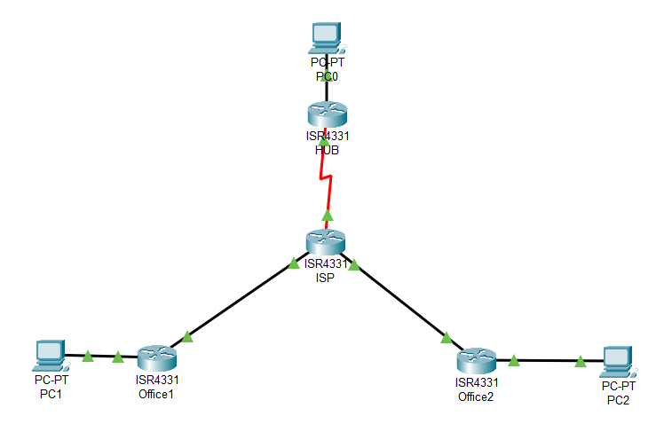

# Настройка DMVPN

## Топология


## ТЗ
У нас есть некая компания. У нее есть головной офис(HUB), а так же два филиала(Office1 и Office2). 

За каждым маршрутизатором находится сеть, которая имитирует локальную сеть офисов:
* HUB — 10.1.1.0/24
* Office1 — 10.1.3.0/24
* Office2 — 10.1.5.0/24 

Для внешних интерфейсов выбраны сети:
* HUB — 192.168.1.0/24
* Office1 — 192.168.3.0/24
* Office2 — 192.168.5.0/24

Внешние сети должны маршрутизироваться по [EIGRP](Base.md#eigrp)

Внутренние сети должны маршрутизироваться по [OSPF](Base.md#ospf). Центральный маршрутизатор/Интернет провайдер, (далее ISP) не должен знать о них.

Связь локальных сетей должна быть сделана через mGRE с использованием IPSEC.

Этапы настройки:
* Настройка внешних интерфейсов и их маршрутизация через [EIGRP](Base.md#eigrp)
* Настройка внутренних интерфейсов и хостов(хосты нужны для проверки работы).
* Создание туннеля в сети 10.10.10.0/24. Для настройки пользуемся командами [отсюда](Tunnel.md). Дополнительно, указываем mtu 1416 и режим туннелирования командой ```tunnel mode gre multipoint```.
* Настройка [OSPF](Base.md#ospf) на туннеле и локальных сетях. Проверка через traceroute.
* Настройка NHRP. В топологии DMVPN есть главный маршрутизатор - Hub и филиалы - spoke. Настройки на них отличаются

        HUB
        Включение NHRP (включается и настраивается на туннельном интерфейсе)
        (config)#interface Tunnel0
        (config-if)#ip nhrp network-id 999

        Автоматическое соответствия между адресами spoke-маршрутизаторов
        (config-if)#ip nhrp map multicast dynamic

        (Опционально) Настройка аутентификации:
        (config-if)#ip nhrp authentication nhrppass

        Spoke
        Включение аналогично HUB
        (config)#interface Tunnel0
        (config-if)#ip nhrp network-id 999

        Адрес туннельного интерфейса hub-маршрутизатора указывается как next-hop-сервер
        (config-if)#ip nhrp nhs 10.10.10.1

        Статически мапим адрес туннельного интерфейса hub-маршрутизатора и физический адрес hub-маршрутизатора
        (config-if)#ip nhrp map 10.10.10.1 192.168.1.1

        Адрес внешнего физического интерфейса hub-маршрутизатора указывается как получатель multicast-пакетов от локального маршрутизатора
        (config-if)#ip nhrp map multicast 192.168.1.1

        (Опционально) Настройка аутентификации
        (config-if)#ip nhrp authentication nhrppass

        Проверка NHRP
        show ip nhrp (nhs|brief|multicast|summary)

* Настройка IPSEC. Настройка будет отличаться от этой [практики](Tunnel.md) использованием метода PROFILE, а не crypto-map и ACL.

        Создаем transform-set
        (config)#crypto ipsec transform-set DMVPN-TR esp-des 

        Так как mGRE обеспечивает нам туннель, IPSEC можно перевести в транспортный режим
        (cfg-crypto-trans)#mode transport 

        Создание IPSEC профила
        (config)#crypto ipsec profile DMVPN
        (config-profile)#set transform-set DMVPN-TR

        Применение профиля
        (config)#interface Tunnel0
        (config-if)#tunnel protection ipsec profile DMVPN

        Команды для проверки
        show crypto isakmp ...

На этом все. За подробным объяснением можно идти [сюда](http://xgu.ru/wiki/%D0%9D%D0%B0%D1%81%D1%82%D1%80%D0%BE%D0%B9%D0%BA%D0%B0_DMVPN_%D0%BD%D0%B0_%D0%BC%D0%B0%D1%80%D1%88%D1%80%D1%83%D1%82%D0%B8%D0%B7%D0%B0%D1%82%D0%BE%D1%80%D0%B0%D1%85_Cisco)