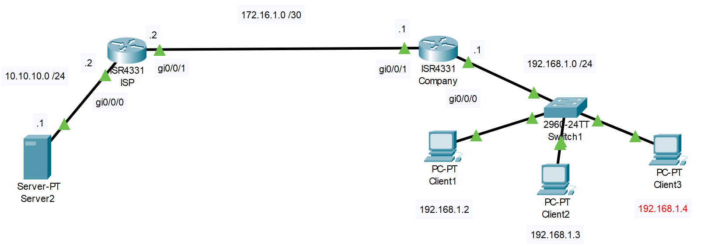

# NAT

## Топология


## ТЗ

Есть два маршрутизатора - ISP и Company. За первым находится веб-сервер в сети 10.10.10.0/24. За вторым находятся клиенты в сети 192.168.1.0/24. Между ISP и Company внешняя сеть - 172.16.1.0/30.

Магическим образом нам нужно сделать трансляцию адресов за ISP в сеть 194.226.224.0/27, а за компанией - 212.193.64.0/27.

Есть два способа - статически и динамически.

### Static NAT
Сделаем на ISP

```
ISP(config)ip nat inside source static 10.10.10.1 194.226.224.1
ISP(config)interface gi0/0/1
ISP(config-if)ip nat outside
ISP(config)interface gi0/0/0
ISP(config-if)ip nat inside
```

Грубо говоря, пакеты от сервера, уходя из ISP будут менять свой адрес на 194.226.224.1, а заходя с этим адресом, будут менять свой адрес обратно на 10.10.10.1

Проверка
```
ISP#show ip nat translations
```

### Dynamic NAT
Настроим на Company, т.к. за ним несколько хостов, что яснее покажет суть технологии

Выделяем блок адресов
```
Company(config)#ip nat pool ClientsPool 212.193.64.1 212.193.64.17 netmask 255.255.255.224
```

Создаем стандартный ACL, чтобы разрешить трансляцию только определенных адресов.
```
Company(config)access-list 1 permit 192.168.1.0 0.0.0.255
```

Связываем пул и ACl
```
Company(config)ip nat inside source list 1 pool ClientsPool
```

Дальше делаем ```inside``` и ```outside``` как в статике.

Суть динамики в том, что мы можем использовать спокойно все наши хосты в компании, и каждый из них будет корректно транслировать адрес.

Для проверки всех переводов адресов
```
Company#show ip nat
```

### PAT (NAT overload)
Технология, которая позволяет, используя один глобальный адрес, транслировать много локальных адресов. Коммутатор различает локальные адреса, используя уникальный TCP/UDP порт для каждого хоста.

Вся настройка происходит так же, как и при обычном dynamic NAT. Разница лишь в одной команде.
```
(Company)#ip nat inside source list 1 pool ClientsPool overload
```

Вывод статистики
```
(Company)#show ip nat statistics
```

Полезно сбросить таблицу переводов после настройки
```
Company#clear ip nat translation *
```

За полным объяснением [сюда](https://wiki.merionet.ru/seti/14/nastrojka-nat-na-cisco/)