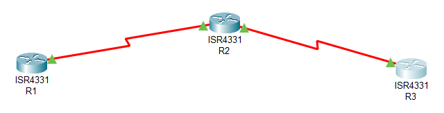

# Настройка туннелирования

## Топология


## ТЗ
Имеется 3 маршрутизатора. Один из них (R2) в центре, остальные (филиалы R1 и R3) подключаются к центральному.

Физически маршрутизаторы соединены по Serial. R1 имеет сеть 172.16.0.0/24, R3 - 172.16.21.0/24, R2 - обе сети. Маршрутизацию между ними нужно сделать по EIGRP.

На R1 и R3 есть локальные сети - LAN(на Loopback интерфейсах) в сетях 10.1.1./24 и 10.3.1.0/24 соответственно. Для маршрутизации LAN нужно использовать OSPF и сделать это через GRE туннель.

GRE туннель должен находиться в сети 192.168.1.0/24 и соединять R1 и R3.

И в конце этого нужно использовать IPSEC для шифрования траффика, проходящего через туннель.

Наши шаги следующие:
1. Задать адреса физическим интерфейсам
2. Настроить [eigrp](Base.md#eigrp)
3. Создать loopback интерфейсы на R1 и R3
4. Настроить туннель

    Пример для R1

        Создать туннель
        #(config)interface Tunnel0

        Задать адрес
        #(config-if)ip address 192.168.1.1 255.255.255.0

        Уменьшить mtu, чтобы влез заголовок gre.
        #(config-if)mtu 1476

        Указать source(это может быть как интерфейс на маршрутизаторе, так и его адрес)
        #(config-if)tunnel source Serial 0/1/0

        И detination(это адрес на на маршрутизаторе на его физическом интерфейсе, до которого мы хотим прокинуть туннель)
        #(config-if)tunnel destination 172.16.21.2
    Все это нужно проделать и для R2, относительно его адресов и интерфейсов.
5. Настроить [ospf](Base.md#ospf) и раздавать через него сети туннеля и LAN. На этом этапе проверить работоспособность можно через tracerout

        R1#traceroute 10.3.1.1
            1   192.168.1.2
        
    Мы должны увидеть, что пакет проходит путь через тунелль, минуя интерфейсы из сети 172.16.0.0/16.
6. Шифрование IPSEC (пример для R1)
    * Настройка политики ISAKMP
    ```
    (config)#crypto isakmp enable
    (config)#crypto isakmp policy 110 
    (config-isakmp)#authentication pre-share
    (config-isakmp)#encryption 3des
    (config-isakmp)#group 2
    (config-isakmp)#hash md5
    (config-isakmp)#lifetime 36000
    ```

    * Создание общего ключа
    ```
    (config)#crypto isakmp key 0 password address 172.16.21.2
    ```

    * Настройка IPSEC transform-set
    ```
    (config)#crypto ipsec transform-set SNRS esp-des 
    (cfg-crypto-trans)#mode tunnel
    (cfg-crypto-trans)#end
    ```

    * Настройка crypto ACL
    ```
    (config)#ip access-list extended 101
    (config-ext-nacl)#permit ip 172.16.0 0.0.0.255 172.61.21.0 0.0.0.255
    ```

    * Настройка crypto map
    ```
    (config)#crypto map SNRS-MAP 10 ipsec-isakmp
    (config-crypto-map)#match address 101
    (config-crypto-map)#set transform-set SNRS
    (config-crypto-map)#set peer 172.16.21.2
    ```

    * Применяем crypto map на интерфейса(физическом!)
    ```
    (config-if)#crypto map SNRS-MAP
    ```

Для теории за всем этим отправляю вас [сюда](https://docs.google.com/document/d/196htDSXKmtVKJ2TKEfiFwbd-k69nxIhYBxfLnjWA3rw/edit#heading=h.dnisxhu5stc4)

Проверить рабоспособность можно через wireshark, например. Вы должны увидеть, что траффик, идущий через туннель зашифрован и имеет заголовок ESP.